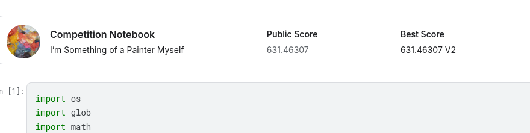
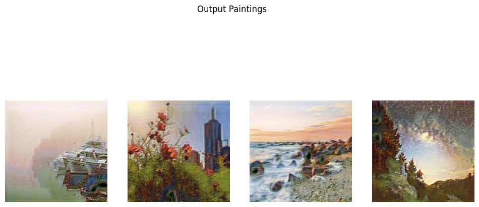

# monet-gan

This repository contains my solution for the "I’m Something of a Painter Myself" Kaggle competition. The goal is to build a Generative Adversarial Network (GAN) that can transform ordinary photos into paintings in the style of Claude Monet.

## Project Overview

I want to capture the unique artistic style of Monet—his use of light, color, and brushstrokes—and apply it to real-world photographs. Since we don't have pairs of (Photo, Monet Painting of that exact photo), I use a special technique called **CycleGAN**.

## How It Works

I implemented a **CycleGAN** using PyTorch. This architecture is designed for "unpaired image-to-image translation". It works by training two generators at the same time:

1.  **Photo -> Monet Generator**: Turns a photo into a Monet painting.
2.  **Monet -> Photo Generator**: Turns a Monet painting back into a photo.

The model learns by ensuring that if you cycle an image (Photo -> Monet -> Photo), you get back the original image. This "Cycle Consistency" keeps the structure of the photo intact while changing the texture and style.

## Data

*   **Monet Paintings**: 300 images of Monet's work.
*   **Photos**: ~7,000 real-world photos.

## Results

I check the results by looking at the generated images to see if they look "artsy" and by using a metric called **MiFID**, which measures image quality and diversity.

## How to Run

1.  **Get the code**:
    Clone this repository.

2.  **Install libraries**:
    You will need Python, `torch` (PyTorch), `torchvision`, `numpy`, `matplotlib`, and `Pillow`.

3.  **Run the Notebook**:
    Open `Monet_GAN_Project.ipynb` in Jupyter Notebook.
    Run the cells to train the model.
    The notebook will automatically generate a `images.zip` file containing 7,000+ Monet-style images ready for submission.
